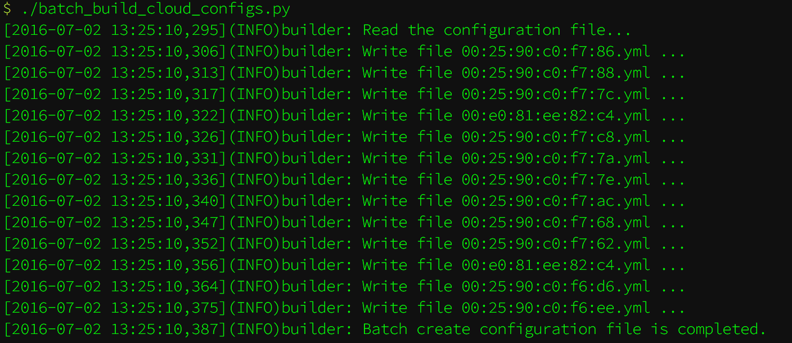

__cloud-config files for the coreos machines inside the company.__

### 修改配置文件

```shell
# 添加一台机器配置
vim build_config.yml
---
10.10.10.191:
  MAC: "00:e0:81:ee:82:c4"
  etcd2: False
  hostname: "coreos-191"
  nic_name: "enp11s0f0"
```

### 修改模板

其中有些模板语言, 如: `"{{ hostname }}"`、`` 等, 这些不能修改, 其他的固化的配置可以修改, 然后统一生效.

```shell
vim cloud-config.template
---
```

### 执行脚本

```shell
./batch_build_cloud_configs.py
```

 